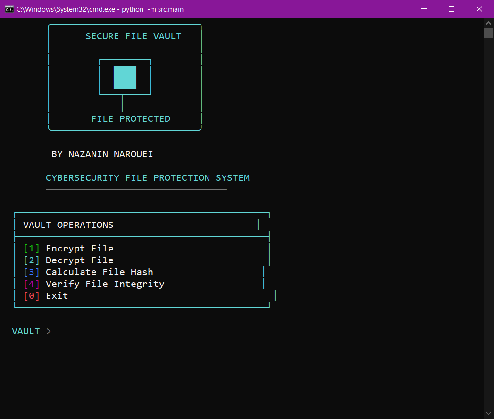
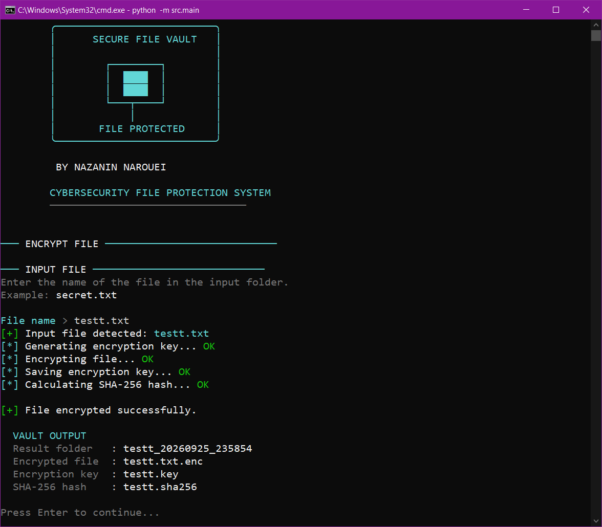

# 🛡️ Secure File Vault

A Python-based secure file protection toolkit for file encryption, decryption, SHA-256 hashing, and integrity verification through an interactive command-line interface.

## ✨ Features

* 🔐 Fernet-based file encryption
* 🔓 Secure file decryption
* 🔑 Encryption key management
* 🧾 SHA-256 file hashing
* ✅ File integrity verification
* 📁 Automatic organization of processed files
* 🖥️ Interactive Command-Line Interface (CLI)
* 🛑 Graceful handling of user cancellation with `Ctrl+C`
## CLI Preview

### Main Interface



### Encryption Workflow



## 📂 Project Structure

```text
Secure-File-Vault/
│
├── input/
│   └── Your original files
│
├── vault-result/
│   └── file_YYYYMMDD_HHMMSS/
│       ├── file.txt.enc
│       ├── file.key
│       └── file.sha256
│
├── src/
│   ├── main.py
│   ├── cli.py
│   ├── paths.py
│   ├── file_encryptor.py
│   ├── key_manager.py
│   ├── file_hasher.py
│   └── integrity_checker.py
│
├── tests/
│
├── README.md
├── requirements.txt
├── LICENSE
└── .gitignore
```

## 🚀 Getting Started

### 1. Clone the repository

```bash
git clone https://github.com/Nazanin-N369/Secure-File-Vault.git
```

### 2. Move into the project

```bash
cd Secure-File-Vault
```

### 3. Install dependencies

```bash
python -m pip install -r requirements.txt
```

### 4. Add a file for processing

Place the original file you want to protect inside the:

```text
input/
```

folder.

For example:

```text
input/
└── secret.txt
```

### 5. Run the application

From the project root:

```bash
python -m src.main
```

## 🖥️ Usage

The application provides four main operations:

### 1. Encrypt File

Enter the name of a file located in the `input/` directory.

The application automatically creates a dedicated result folder containing the encrypted file, encryption key, and SHA-256 hash.

### 2. Decrypt File

Enter the original file name.

The application automatically locates the corresponding encrypted file and key and creates the decrypted file inside the associated result folder.

### 3. Calculate File Hash

Enter the original file name.

The application calculates its SHA-256 hash and saves the result in the corresponding result folder.

### 4. Verify File Integrity

Enter the original file name.

The application compares the current SHA-256 hash of the file with the previously stored hash.

If the file has been modified, the integrity verification fails.

## 🔐 Security Design

The project uses:

* **Fernet** symmetric authenticated encryption for file encryption.
* **SHA-256** for file integrity verification.
* Separate encryption keys stored alongside the corresponding encrypted file.
* Controlled file processing through the dedicated `input/` directory.
* Automatic result organization using timestamped case folders.

> This project is an educational security engineering project and should not be considered a replacement for professionally audited file-encryption software.

## 🧪 Testing

Run the automated test suite from the project root:

```bash
pytest
```

The test suite covers the core encryption, key management, hashing, and integrity functionality.

## 🛠️ Built With

* Python 3
* `cryptography`
* `hashlib`
* `pytest`

## 🚧 Future Improvements

Possible future improvements include:

* Digital signature support
* Multiple-file processing
* Folder encryption
* Secure file deletion
* Improved terminal interface
* Progress indicators
* Additional automated security tests

## 📜 License

This project is licensed under the MIT License.

## 👩‍💻 Author

**Nazanin Narouei**

Cybersecurity Student | Secure Software Development | Critical Infrastructure Security
